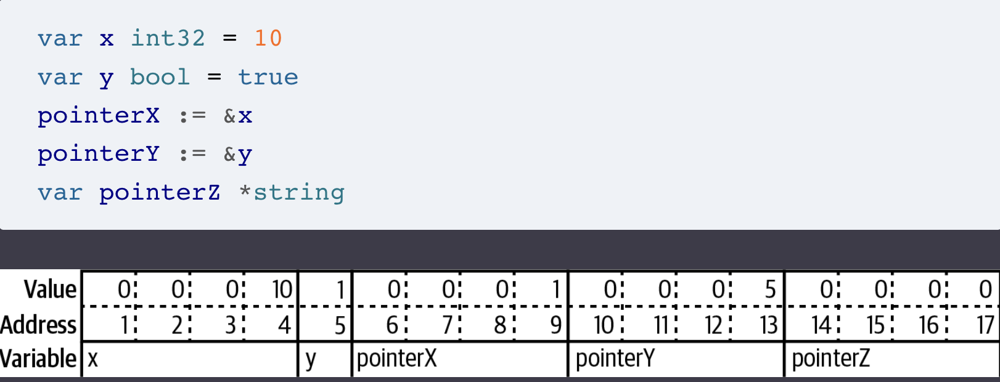

# Learning Go, 2nd Edition

- [Learning Go, 2nd Edition](#learning-go-2nd-edition)
  - [Built-in types and variables](#built-in-types-and-variables)
    - [String literals](#string-literals)
    - [Integers](#integers)
    - [Floating types](#floating-types)
    - [Conversions](#conversions)
    - [Variable declarations](#variable-declarations)
    - [Other considerations](#other-considerations)
  - [Composite types](#composite-types)
    - [Arrays](#arrays)
    - [Slices](#slices)
      - [Slicing Slices](#slicing-slices)
    - [Strings and Runes and Bytes](#strings-and-runes-and-bytes)
    - [Maps](#maps)
    - [Structs](#structs)
  - [Blocks, Shadows, and Control Structures](#blocks-shadows-and-control-structures)
    - [Blocks and shadows](#blocks-and-shadows)
    - [Control structures](#control-structures)
      - [if/else](#ifelse)
      - [for](#for)
      - [switch](#switch)
  - [Functions](#functions)
    - [Emulating optional parameters](#emulating-optional-parameters)
    - [Variadic parameters](#variadic-parameters)
    - [Multiple return values](#multiple-return-values)
    - [Named returned values](#named-returned-values)
    - [Functions Are Values](#functions-are-values)
    - [Anonymous Functions](#anonymous-functions)
    - [Closures](#closures)
      - [Functions as Parameters and returned values](#functions-as-parameters-and-returned-values)
    - [defer](#defer)
    - [Call-by-value](#call-by-value)
  - [Pointers](#pointers)
    - [Pointers Indicate Mutable Parameters](#pointers-indicate-mutable-parameters)
    - [Reducing the Garbage Collector’s Workload](#reducing-the-garbage-collectors-workload)
      - [The heap](#the-heap)
      - [Tuning the Garbage Collector](#tuning-the-garbage-collector)


## Built-in types and variables

**Predeclared types** are the built-in types in the language. A Go **literal** is an explicitly specified number, character, or string.

### String literals

A **rune** literal represents a character and is surrounded by single quotes.
An **interpreted** string literal is a string literal with double quotes contain zero or more rune literals. If you need to include backslashes, double quotes, or newlines in your string, using a **raw string literal** is easier. These are delimited with backquotes (`) and can contain any character except a backquote.
The **zero value** for a string is the empty string. Strings in Go are **immutable**; you can reassign the value of a string variable, but you cannot change the value of the string that is assigned to it.

### Integers

Type integer (signed/unsigned) from one to eight bytes (int8 - uint64).   There are some aliases (listing a subset here):
* byte for uint8
* int for int32/int64 (literal default)

> [!NOTE] Which integer to use
> * If you are working with a binary file format or network protocol that has an integer of a specific size or sign, use the corresponding integer type.
> * If you are writing a library function that should work with any integer
> type, take advantage of Go’s generics support and use a generic type
> * In all other cases, just use int

### Floating types

There's float32 and float64. Like the integer types, the zero value for the floating-point types is 0.
Unless you have to be compatible with an existing format, use float64. Floating-point literals have a default type of float64, so always using float64 is the simplest option.

> [!Warning]
> Do not use them to represent money or any other value that must have an exact decimal representation. Don't also use `!=` and `==` for comparing floats

### Conversions

Go doesn’t allow automatic type promotion between variables. You must use a type conversion when variable types do not match. Even different-sized integers and floats must be converted to the same type to interact.

```go
var x int = 10
var y float64 = 30.2
var sum1 float64 = float64(x) + y
var sum2 int = x + int(y)
fmt.Println(sum1, sum2) // 40.2 40
```

You cannot treat another Go type as a boolean, **Go doesn’t allow truthiness**.  If you want to convert from another data type to boolean, you must use one of the comparison operators

### Variable declarations

```go
var x, y int = 10, 20
var x int = 10
var x = 10 // int
var x, y = 10, "hello"
var x int // zero value
// declaration list
var (
    x    int
    y        = 20
    z    int = 30
    d, e     = 40, "hello"
    f, g string
)
```

When you are within a function, you can use the := operator to replace a var declaration that uses type inference.
If you are declaring a variable at the package level, you must use var because `:=` is not legal outside of functions

```go
x := 10
x, y := 30, "hello"
```

In general:
* When initializing a variable to its zero value, use var x int to make it clear that the zero value is intended.
* When assigning an untyped constant or a literal to a variable and the default type for the constant or literal isn’t the type you want for the variable, use the long var form with the type specified.
* declare all your new variables with `var` to make it clear which variables are new, and then use the assignment operator (=) to assign values to both new and old variables.
* you should only declare variables in the package block that are effectively immutable

### Other considerations

* every declared local variable must be read. It is a compile-time error to declare a local variable and to not read its value.
* Go requires identifier names to start with a letter or underscore, and the name can contain numbers, underscores, and letters
* The smaller the scope for a variable, the shorter the name that’s used for it.

## Composite types

### Arrays

* all elements in the array must be of the type that’s specified.
* you cannot read or write past the end of an array or use a negative index.
* Go considers the size of the array to be part of the type of the array.
* the size of an array must be a number, can't be a variable
* you can’t use a type conversion to directly convert arrays of different sizes to identical types

```go
var x [3]int // zero values
var x = [3]int{10, 20, 30} // or var x = [...]int{10, 20, 30}
var x = [12]int{1, 5: 4, 6, 10: 100, 15} // sparse array, indices with nonzero values
```

### Slices

Data structure for holding a sequence of values where its length is not part of its type. It's zero value is `nil`.

```go
var x []int // nil slice
var x = []int{} // zero length and zero capacity
var x = []int{10, 20, 30}
var x = []int{1, 5: 4, 6, 10: 100, 15}
```

Slices are not comparable, the only thing you can compare a slice with using `==` is `nil`. There are functions to compare slices in the `slices` package (Equal, EqualFunc, etc).
The **length** of a slice is the number of consecutive memory locations that have been assigned a value (built-in `len` function). Every slice also has a **capacity**, which is the number of consecutive memory locations reserved and can be larger than the length (built-in `cap` function). If you try to add additional values when the length equals the capacity, the append function uses the Go runtime to allocate a new backing array for the slice with a larger capacity. The values in the original backing array are copied to the new one, the new values are added to the end of the new backing array, and the slice is updated to refer to the new backing array. Finally, the updated slice is returned.
`make` allows you to specify the type, length, and, optionally, the capacity

```go
x := make([]int, 5) // initial length
x := make([]int, 5, 10) // initial length and capacity
```

* minimize the number of times the slice needs to grow
* If it’s possible that the slice won’t need to grow at all, use a var declaration with no assigned value to create a nil slice
* If you have some starting values, or if a slice’s values aren’t going to change, then a slice literal is a good choice
* If you have a good idea of how large your slice needs to be, but don’t know what those values will be when you are writing the program, use make:
  * If you are using a slice as a **buffer**, then specify a nonzero length.
  * If you are sure you know the exact size you want, you can specify the length and index into the slice to set the values
  * otherwise zero length and a specified capacity

#### Slicing Slices

When you take a slice from a slice, you are not making a copy of the data. Instead, you now have two variables that are sharing memory. This means that changes to an element in a slice affect all slices that share that element.

```go
	base := []string{"a", "b", "c", "d"}
	copybase := base[:2]
	another := base[1:]
	yetanother := base[1:3]
	last := base[:]
	fmt.Println("base:", base) 				// prints [a, b, c, d]
	fmt.Println("copybase:", copybase)		// prints [a, b]
	fmt.Println("another:", another)		// prints [b, c, d]
	fmt.Println("yetanother:", yetanother)	// prints [b, c]
	fmt.Println("last:", last)				// prints [a, b, c, d]
```

Whenever you take a slice from another slice, the subslice’s capacity is set to the
capacity of the original slice, minus the starting offset of the subslice within the
original slice. To avoid complicated slice situations, **you should either never use append with a subslice or make sure that append doesn’t cause an overwrite by using a full slice expression**.
If you need to create a slice that’s independent of the original, use the built-in `copy` function. The capacity of x and y doesn’t matter; it’s the length that’s important.

```go
x := []int{1, 2, 3, 4}
y := make([]int, 4)
num := copy(y, x)
fmt.Println(y, num)
```

You can covert arrays (or a subset of array) to slices. Be aware that taking a slice from an array has the same memory-sharing properties as taking a slice from a slice.

```go
xArray := [4]int{5, 6, 7, 8}
xSlice := xArray[:]
```

and viceversa:

```go
xSlice := []int{1, 2, 3, 4}
xArray := [4]int(xSlice)
smallArray := [2]int(xSlice)
xSlice[0] = 10
fmt.Println(xSlice) // [10 2 3 4]
fmt.Println(xArray) // [1 2 3 4]
fmt.Println(smallArray) // [1, 2]
```

### Strings and Runes and Bytes

Go uses a sequence of bytes to represent a string

```go
var s string = "Hello there"
var b byte = s[6]

// slice
var s string = "Hello there"
var s2 string = s[4:7] // "o t" careful, with non-english languages you don't get this
```

Conversions:

```go
var a rune    = 'x'
var s string  = string(a)
var b byte    = 'y'
var s2 string = string(b)
```

### Maps

The map type is written as `map[keyType]valueType`. The zero value for a map is nil with lenght 0. Attempting to write to a nil map variable causes a panic.

```go
totalWins := map[string]int{} // empty map literal is writable

teams := map[string][]string {
    "Orcas": []string{"Fred", "Ralph", "Bijou"},
    "Lions": []string{"Sarah", "Peter", "Billie"},
    "Kittens": []string{"Waldo", "Raul", "Ze"},
}

ages := make(map[int][]string, 10)
```

* Maps automatically grow as you add key-value pairs to them.
* If you know how many key-value pairs you plan to insert into a map, you can use make to create a map with a specific initial size.
* Passing a map to the len function tells you the number of key-value pairs in a map.
* The zero value for a map is nil.
* Maps are not comparable. You can check if they are equal to nil, but you cannot check if two maps have identical keys and values using == or differ using !=.
* The key for a map can be any comparable type. This means you cannot use a slice or a map as the key for a map.

### Structs

```go
type person struct {
    name string
    age  int
    pet  string
}

var fred person
bob := person{}
julia := person{
    "Julia",
    40,
    "cat",
}
beth := person{
    age:  30,
    name: "Beth",
}
bob.name = "Bob"
fmt.Println(bob.name)

// anonymous struct
pet := struct {
    name string
    kind string
}{
    name: "Fido",
    kind: "dog",
}
```

* A struct type that’s defined within a function can be used only within that function.
* A zero value struct has every field set to the field’s zero value.
* Structs that are entirely composed of comparable types are comparable; those with slice or map fields are not
* if two struct variables are being compared and at least one has a type that’s an anonymous struct, you can compare them without a type conversion if the fields of both structs have the same names, order, and types.

You might wonder when it’s useful to have a data type that’s associated only with a single instance. Anonymous structs are handy in two common situations. The first is when you translate external data into a struct or a struct into external data (like JSON or Protocol Buffers). This is called **unmarshaling** and **marshaling** data, respectively. Writing tests is another place where anonymous structs pop up.

## Blocks, Shadows, and Control Structures

### Blocks and shadows

Each place where a declaration occurs is called a **block**. Variables, constants, types, and functions declared outside of any functions are placed in the **package block**. Import statements are in the **file block**. built-in types, constants and function (like `make`) are in the **universe block**.
When you have a declaration with the same name as an identifier in a containing block, you **shadow** the identifier created in the outer block.

```go
/* 10
   5
   10 */
func main() {
    x := 10
    if x > 5 {
        fmt.Println(x)
        x := 5 // shadowing x
        fmt.Println(x)
    }
    fmt.Println(x)
}
```

A **shadowing variable** is a variable that has the same name as a variable in a containing block. For as long as the shadowing variable exists, you cannot access a shadowed variable.
Same thing can happen to packages if you declare a variable named like a package, and also to universe block's elements.

### Control structures

#### if/else

```go
// It lets you create variables available only where needed.
if n := rand.Intn(10); n == 0 {
    fmt.Println("That's too low")
} else if n > 5 {
    fmt.Println("That's too big:", n)
} else {
    fmt.Println("That's a good number:", n)
}
// n here is undefined
```

#### for

`for` is the only looping keyword in the language and can be used in four format. Favor a for-range loop when iterating over all the contents of an instance of one of the built-in compound types. It avoids a great deal of boilerplate code that’s required when you use an array, slice, or map with one of the other for loop styles.

```go
// Complete C-style
for i := 0; i < 10; i++ {
    fmt.Println(i)
}

// Complete C-style wiht initialization already done outside
i := 0
for ; i < 10; i++ {
    fmt.Println(i)
}

// Condition-Only for Statement: it's like a while
i := 1
for i < 100 {
  fmt.Println(i)
  i = i * 2
}

// infinite and break/continue
for {
    // things to do in the loop
    if !CONDITION {
        break
    }
}

for i := 1; i <= 100; i++ {
    if i%3 == 0 && i%5 == 0 {
        fmt.Println("FizzBuzz")
        continue
    }
    if i%3 == 0 {
        fmt.Println("Fizz")
        continue
    }
    if i%5 == 0 {
        fmt.Println("Buzz")
        continue
    }
    fmt.Println(i)
}

// for-range Statement
// only to iterate over the built-in compound types and
// user-defined types that are based on them
evenVals := []int{2, 4, 6, 8, 10, 12}
// If you don’t need to access the key, use an underscore (_)
for _, v := range evenVals {
    fmt.Println(v)
}

// or just the keys
uniqueNames := map[string]bool{"Fred": true, "Raul": true, "Wilma": true}
for k := range uniqueNames {
    fmt.Println(k)
}
```

#### switch

break statements aren't needed in Go for case statements, however you can use them if you want to exit prematurely, even if may signals you're doing something too complicated.

```go
for _, word := range words {
    switch size := len(word); size {
    case 1, 2, 3, 4:
        fmt.Println(word, "is a short word!")
    case 5:
        wordLen := len(word)
        fmt.Println(word, "is exactly the right length:", wordLen)
    case 6, 7, 8, 9: // nothing happens!
    default:
        fmt.Println(word, "is a long word!")
    }
}
```

## Functions

Go doesn’t have: named and optional input parameters. If you want to emulate named and optional parameters, define a struct that has fields that match the desired parameters, and pass the struct to your function

### Emulating optional parameters

```go
type MyFuncOpts struct {
    FirstName string
    LastName  string
    Age       int
}

func MyFunc(opts MyFuncOpts) error {
    // do something here
}

func main() {
    MyFunc(MyFuncOpts{
        LastName: "Patel",
        Age:      50,
    })
    MyFunc(MyFuncOpts{
        FirstName: "Joe",
        LastName:  "Smith",
    })
}
```

### Variadic parameters

Go supports variadic parameters. The variadic parameter must be the last (or only) parameter in the input parameter list.

```go
func addTo(base int, vals ...int) []int {
    out := make([]int, 0, len(vals))
    for _, v := range vals {
        out = append(out, base+v)
    }
    return out
}
```

### Multiple return values

Go allows for multiple return values. When a Go function returns multiple values, the types of the return values are listed in parentheses, separated by commas. If the function completes successfully, you return nil for the error’s value.  By convention, the error is always the last (or only) value returned from a function.

```go
func divAndRemainder(num, denom int) (int, int, error) {
    if denom == 0 {
        return 0, 0, errors.New("cannot divide by zero")
    }
    return num / denom, num % denom, nil
}
```

### Named returned values

When you supply names to your return values, what you are doing is predeclaring variables that you use within the function to hold the return values. You must surround named return values with parentheses, even if there is only a single return value.

```go
func divAndRemainder(num, denom int) (result int, remainder int, err error) {
    if denom == 0 {
        err = errors.New("cannot divide by zero")
        return result, remainder, err
    }
    result, remainder = num/denom, num%denom
    // we could have just written return (blank return) to return
    // the last values assigned to the named return values, avoid it
    return result, remainder, err
}
```

### Functions Are Values

Since functions are values, you can declare a function variable. Here myFuncVariable can be assigned any function that has a single parameter of type string and returns a single value of type int.

```go
func f1(a string) int {
    return len(a)
}

func f2(a string) int {
    total := 0
    for _, v := range a {
        total += int(v)
    }
    return total
}

func main() {
    var myFuncVariable func(string) int
    myFuncVariable = f1
    result := myFuncVariable("Hello")
    fmt.Println(result)

    myFuncVariable = f2
    result = myFuncVariable("Hello")
    fmt.Println(result)
}
```

### Anonymous Functions

Declaring anonymous functions without assigning them to variables is useful in two situations: `defer` statements and launching goroutines.

```go
func main() {
    f := func(j int) {
        fmt.Println("printing", j, "from inside of an anonymous function")
    }
    for i := 0; i < 5; i++ {
        f(i)
    }
}

func main() {
    for i := 0; i < 5; i++ {
        func(j int) {
            fmt.Println("printing", j, "from inside of an anonymous function")
        }(i)
    }
}
```

### Closures

Functions declared inside functions are able to access and modify variables declared in the outer function.
One thing that closures allow you to do is to **limit a function’s scope**. If a function is going to be called from only one other function, but it’s called multiple times, you can use an inner function to “hide” the called function. It can also be used for **DRY principle** in case a piece of code is executed multiple times.

#### Functions as Parameters and returned values

```go
type Person struct {
    FirstName string
    LastName  string
    Age       int
}

people := []Person{
    {"Pat", "Patterson", 37},
    {"Tracy", "Bobdaughter", 23},
    {"Fred", "Fredson", 18},
}

sort.Slice(people, func(i, j int) bool {
    return people[i].Age < people[j].Age
})
// [{Fred Fredson 18} {Tracy Bobdaughter 23} {Pat Patterson 37}]
fmt.Println(people)
```

```go
func makeMult(base int) func(int) int {
    return func(factor int) int {
        return base * factor
    }
}

twoBase := makeMult(2)
threeBase := makeMult(3)
for i := 0; i < 3; i++ {
    fmt.Println(twoBase(i), threeBase(i))
}
```

### defer

In Go, the cleanup code for releases resources is attached to the function with the `defer` keyword. Below `defer`  delays the invocation until the surrounding function exits (also after return).

```go
f, err := os.Open(os.Args[1])
defer f.Close()
data := make([]byte, 2048)
for {
    count, err := f.Read(data)
    //...
}
```

You can use a function, method, or closure with defer. You can defer multiple functions in a Go function. They run in LIFO order.

```go
/*
exiting: 30
second: 20
first: 10
*/
func deferExample() int {
    a := 10
    defer func(val int) {
        fmt.Println("first:", val)
    }(a)
    a = 20
    defer func(val int) {
        fmt.Println("second:", val)
    }(a)
    a = 30
    fmt.Println("exiting:", a)
    return a
}
```

There’s a way for a deferred function to examine or modify the return values of its surrounding function. Here is a pattern that uses defer to add contextual information to an error returned from a function:

```go
func DoSomeInserts(ctx context.Context, db *sql.DB, value1, value2 string)
                  (err error) {
    tx, err := db.BeginTx(ctx, nil)
    if err != nil {
        return err
    }
    defer func() {
        if err == nil {
            err = tx.Commit()
        }
        if err != nil {
            tx.Rollback()
        }
    }()
    _, err = tx.ExecContext(ctx, "INSERT INTO FOO (val) values $1", value1)
    if err != nil {
        return err
    }
    // use tx to do more database inserts here
    return nil
}
```

A common pattern in Go is for a function that allocates a resource to also return a closure that cleans up the resource:

```go
func getFile(name string) (*os.File, func(), error) {
    file, err := os.Open(name)
    if err != nil {
        return nil, nil, err
    }
    return file, func() {
        file.Close()
    }, nil
}

f, closer, err := getFile(os.Args[1])
if err != nil {
    log.Fatal(err)
}
defer closer()
```

### Call-by-value

It means that when you supply a variable for a parameter to a function, Go always makes a copy of the value of the variable. This is true for primitive types and structs, but any changes made to a map parameter are reflected in the variable passed into the function. You can modify any element in the slice, but you can’t lengthen the slice.
Since variables are passed by value, you can be sure that calling a function doesn’t modify the variable whose value was passed in (unless the variable is a slice or map)

## Pointers

A pointer is a variable that holds the location in memory where a value is stored. Every variable is stored in one or more contiguous memory locations, called **addresses**. Different types of variables can take up different amounts of memory.



The zero value for a pointer is nil. Since Go has a garbage collector, most memory management pain is removed.
The `&` is the address operator. It precedes a value type and returns the address where the value is stored. The * is the indirection operator. It precedes a variable of pointer type and returns the pointed-to value. This is called **dereferencing**.

```go
x := 10
pointerToX := &x
fmt.Println(pointerToX)  // prints a memory address
fmt.Println(*pointerToX) // prints 10
z := 5 + *pointerToX
fmt.Println(z)           // prints 15
```

Before dereferencing a pointer, you must make sure that the pointer is non-nil. A pointer type is a type that represents a pointer. It is written with a `*` before a type name and can be based on any type.
The built-in function `new` (rarely used) creates a pointer variable. It returns a pointer to a zero-value instance of the provided type:

```go
var x = new(int)
fmt.Println(x == nil) // prints false
fmt.Println(*x)       // prints 0
```

You can’t use an `&` before a primitive literal (numbers, booleans, and strings) or a constant because they don’t have memory addresses; they exist only at compile time. When you need a pointer to a primitive type, declare a variable and point to it

```go
x := &Foo{}
var y string
z := &y
```

If you have a struct with a field of a pointer to a primitive type, you can’t assign a literal directly to the field.

```go
type person struct {
    FirstName  string
    MiddleName *string
    LastName   string
}

/*
p := person{
  FirstName:  "Pat",
  MiddleName: "Perry", // This line won't compile
  LastName:   "Peterson",
} */
```

There are two ways around this problem. The first is to do what was shown previously, which is to introduce a variable to hold the constant value. The second way is to write a generic helper function that takes in a parameter of any type and returns a pointer to that type:

```go
func makePointer[T any](t T) *T {
    return &t
}

p := person{
  FirstName:  "Pat",
  MiddleName: makePointer("Perry"), // This works
  LastName:   "Peterson",
}
```

### Pointers Indicate Mutable Parameters

The lack of immutable declarations in Go might seem problematic, but the ability to choose between value and pointer parameter types addresses the issue. Rather than declare that some variables and parameters are immutable, Go developers use pointers to indicate that a parameter is mutable.
Since Go is a call-by-value language, the values passed to functions are copies. For nonpointer types like primitives, structs, and arrays, this means that the called function cannot modify the original. Since the called function has a copy of the original data, the original data’s immutability is guaranteed. However, if a pointer is passed to a function, the function gets a copy of the pointer. This still points to the original data, which means that the original data can be modified by the called function.

* when you pass a nil pointer to a function, you cannot make the value non-nil. You can reassign the value only if there was a value already assigned to the pointer.
* if you want the value assigned to a pointer parameter to still be there when you exit the function, you must dereference the pointer and set the value

```go
func failedUpdate(px *int) {
    x2 := 20
    px = &x2
}

func update(px *int) {
    *px = 20
}

func main() {
    x := 10
    failedUpdate(&x)
    fmt.Println(x) // prints 10
    update(&x)
    fmt.Println(x) // prints 20
}
```

> [!NOTE]
> You should be careful when using pointers in Go.
> As discussed earlier, they make it harder to understand data flow and can create extra work for the garbage collector. The only time you should use pointer parameters to modify a variable is when the function expects an interface.

When converting data back and forth from JSON you often need a way to differentiate between the zero value and not having a value assigned at all. Use a pointer value for fields in the struct that are nullable.
When not working with JSON (or other external protocols), resist the temptation to use a pointer field to indicate no value.

### Reducing the Garbage Collector’s Workload

A **stack** is a consecutive block of memory. Every function call in a thread of execution shares the same stack. Allocating memory on the stack is fast and simple.
A **stack pointer** tracks the last location where memory was allocated. Allocating additional memory is done by changing the value of the stack pointer.
When a function is invoked, a new stack frame is created for the function’s data. Local variables are stored on the stack, along with parameters passed into a function. Each new variable moves the stack pointer by the size of the value. When a function exits, its return values are copied back to the calling function via the stack, and the stack pointer is moved back to the beginning of the stack frame for the exited function, deallocating all the stack memory that was used by that function’s local variables and parameters.
To store something on the stack, you have to know exactly how big it is at compile time. When you look at the value types in Go (primitive values, arrays, and structs), they all have one thing in common: you know exactly how much memory they take at compile time. This is why the size is considered part of the type for an array. Because their sizes are known, they can be allocated on the stack instead of the heap. The size of a pointer type is also known, and it is also stored on the stack.
The rules are more complicated when it comes to the data that the pointer points to. In order for Go to allocate the data the pointer points to on the stack, several conditions must be true:
* The data must be a local variable whose data size is known at compile time
* The pointer cannot be returned from the function
* If the pointer is passed into a function, the compiler must be able to ensure that these conditions still hold.
* If the size isn’t known, you can’t make space for it by moving the stack pointer.
* If the pointer variable is returned, the memory that the pointer points to will no longer be valid when the function exits.

#### The heap

When the compiler determines that the data can’t be stored on the stack, we say that the data the pointer points to escapes the stack, and the compiler stores the data on the **heap**. The heap is the memory that’s managed by the garbage collector. Any data that’s stored on the heap is valid as long as it can be tracked back to a pointer type variable on a stack. Once there are no more variables on the stack pointing to that data, either directly or via a chain of pointers, the data becomes garbage, and it’s the job of the garbage collector to clear it out.
Two performance problems related to storing data to the heap:
* the garbage collector takes time to do its work
* the fastest way to read from memory is to read it sequentially. A slice of structs in Go has all the data laid out sequentially in memory. This makes it fast to load and fast to process. A slice of pointers to structs (or structs whose fields are pointers) has its data scattered across RAM, making it far slower to read and process.

Now you can see why Go encourages you to use pointers sparingly. You reduce the garbage collector’s workload by making sure that as much as possible is stored on the stack.  Slices of structs or primitive types have their data lined up sequentially in memory for rapid access. And when the garbage collector does do work, it is optimized to return quickly rather than gather the most garbage. The key to making this approach work is to simply create less garbage in the first place. While focusing on optimizing memory allocations can feel like premature optimization, the idiomatic approach in Go is also the most efficient.

#### Tuning the Garbage Collector

The Go runtime provides users a couple of settings to control the heap’s size;
* `GOGC` env variable (default 100): the garbage collector looks at the heap size at the end of a garbage-collection cycle and uses the formula `CURRENT_HEAP_SIZE + CURRENT_HEAP_SIZE*GOGC / 100` to calculate the heap size that needs to be reached to trigger the next garbage-collection cycle. As a rough estimate, doubling the value of GOGC will halve the amount of CPU time spent on GC.
* `GOMEMLIMIT` (default `math.MaxInt64`): soft limit on the total amount of memory your Go program is allowed to use. It's specified in bytes byt you can use also values like `3GiB` to set the memory limit to 3 gibibytes.